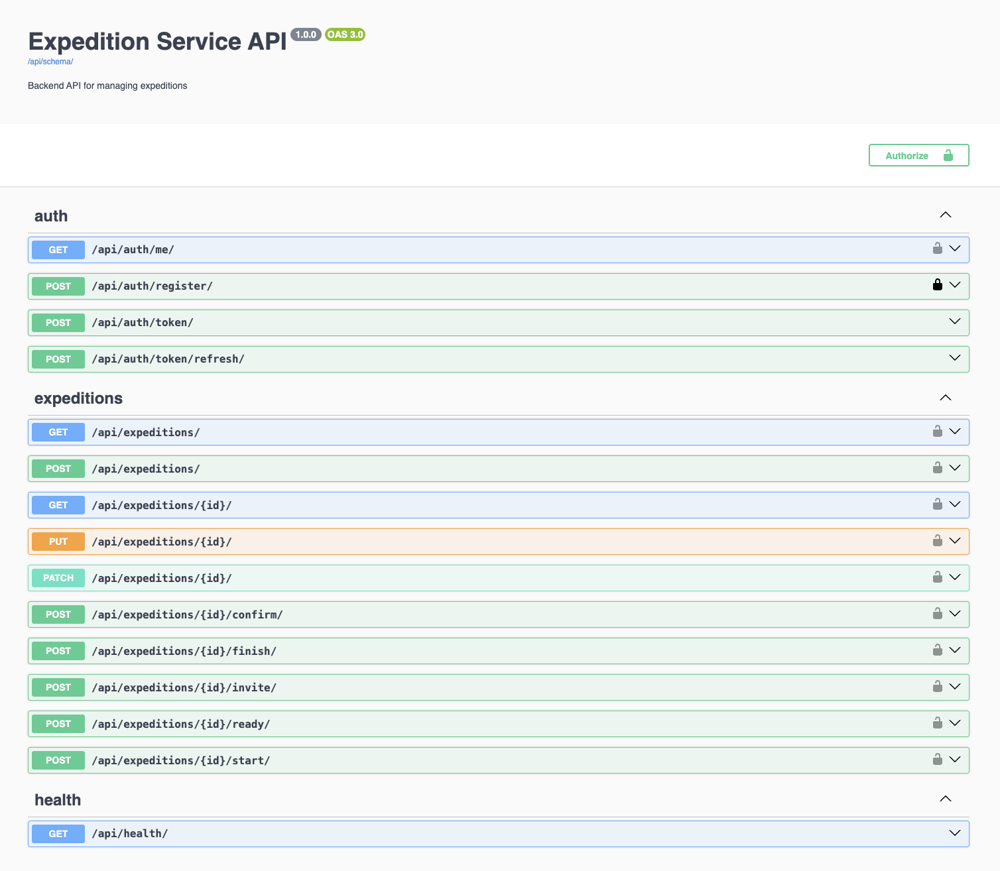

# Expedition Service

Застосунок для керування експедиціями.

**Стек:** Django, DRF, JWT, PostgreSQL, Redis, Channels, Docker

## Запуск

```bash
cp .env.example .env
docker compose up -d --build
```

Сервіс: http://localhost:8000  
Swagger: http://localhost:8000/api/docs/



## API

### Auth

| Method | URL |
|--------|-----|
| POST | `/api/auth/register/` |
| POST | `/api/auth/token/` |
| POST | `/api/auth/token/refresh/` |
| GET | `/api/auth/me/` |

### Expeditions

| Method | URL | Хто |
|--------|-----|-----|
| GET | `/api/expeditions/` | chief / member |
| POST | `/api/expeditions/` | chief |
| GET | `/api/expeditions/{id}/` | chief / member |
| PATCH | `/api/expeditions/{id}/` | chief (draft) |
| POST | `/api/expeditions/{id}/invite/` | chief |
| POST | `/api/expeditions/{id}/confirm/` | member |
| POST | `/api/expeditions/{id}/ready/` | chief |
| POST | `/api/expeditions/{id}/start/` | chief |
| POST | `/api/expeditions/{id}/finish/` | chief |

Авторизація: `Authorization: Bearer <access_token>`

## Сценарій:

1. Зареєструвати `chief` і двох `member` через `/api/auth/register/`
2. Отримати токени через `/api/auth/token/`
3. Chief створює expedition (`POST /api/expeditions/`)
4. Chief запрошує members (`POST .../invite/`, body: `{"email": "..."}`)
5. Кожен member підтверджує участь (`POST .../confirm/`)
6. Chief: `ready` → `start` → `finish`

Для `start` потрібно: `start_at` в минулому, мінімум 2 confirmed members, всі в межах `capacity`.

## WebSocket

```
ws://localhost:8000/ws/expeditions/?token=<access_token>
```

Події: `member_invited`, `member_confirmed`, `expedition_status`  
Отримують лише chief і members відповідної expedition.

## Тести

```bash
source .venv/bin/activate
pip install -r requirements.txt
pytest
```
